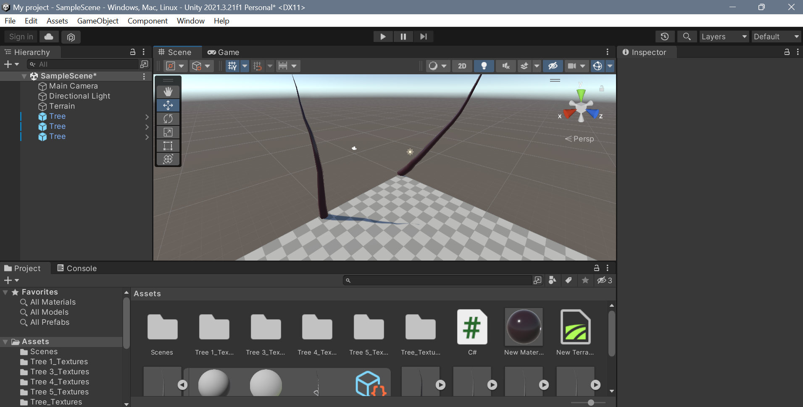
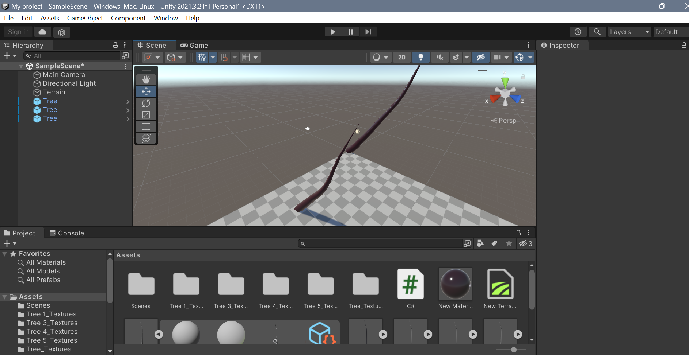

# Rotating-the-Gaming-Object

## Aim:
To develop a 3D application for rotating the gaming objects in unity.
## Algorithm:
## Step 1:
 Start

## Step 2:
Click File -> Scene -> Select the scene -> Save as-> New folder(Scenes)-> File name (Exp1)
## Step 3:
Click Hierarchy -> 3DObject -> Cylinder
Hierarchy -> 3DObject -> Capsule
Hierarchy -> 3DObject -> Text
Hierarchy -> Effects -> Particle system
## Step 4:
Create a folder in project and name as Materials
Material folder -> Create -> Material (Name: Capsule)
Inspector ->Surface Inputs ->BaseMAp (Choose the color)
Drag the Cylinder to the plane and release the mouse
## Step 5:
Click Hierarchy -> DirectionalLight
Inspector -> Change the color to white (255,255,255)
## Step 6:
 Create a folder name Coding and create a C# file to add the coding in it.

## Step 7:
 To add our C# Script file to our selected object, click on the C# Script file and drag it to our selected objects in the Hierarchy window nad run the application.

## Step 8:
 Stop

### Start8:
Stop

## Program:

```py
# DEVELOPED BY:- EZHIL MATHI R
# REG NO:- 212221230026


using System.Collections;
using System.Collections.Generic;
using UnityEngine;

public class code : MonoBehaviour
{
    // Start is called before the first frame update
    void Start()
    {

    }

    // Update is called once per frame
    void Update()
    {
        transform.RotateAround(Vector3.right, Vector3.up, 40 * Time.deltaTime);
    }
}

```


## Output:

Before Rotation:-


After Rotation:-



TEXT:-


## Result:
Thus a 3D application for rotating the gaming objects in unity is developed sucessfully.